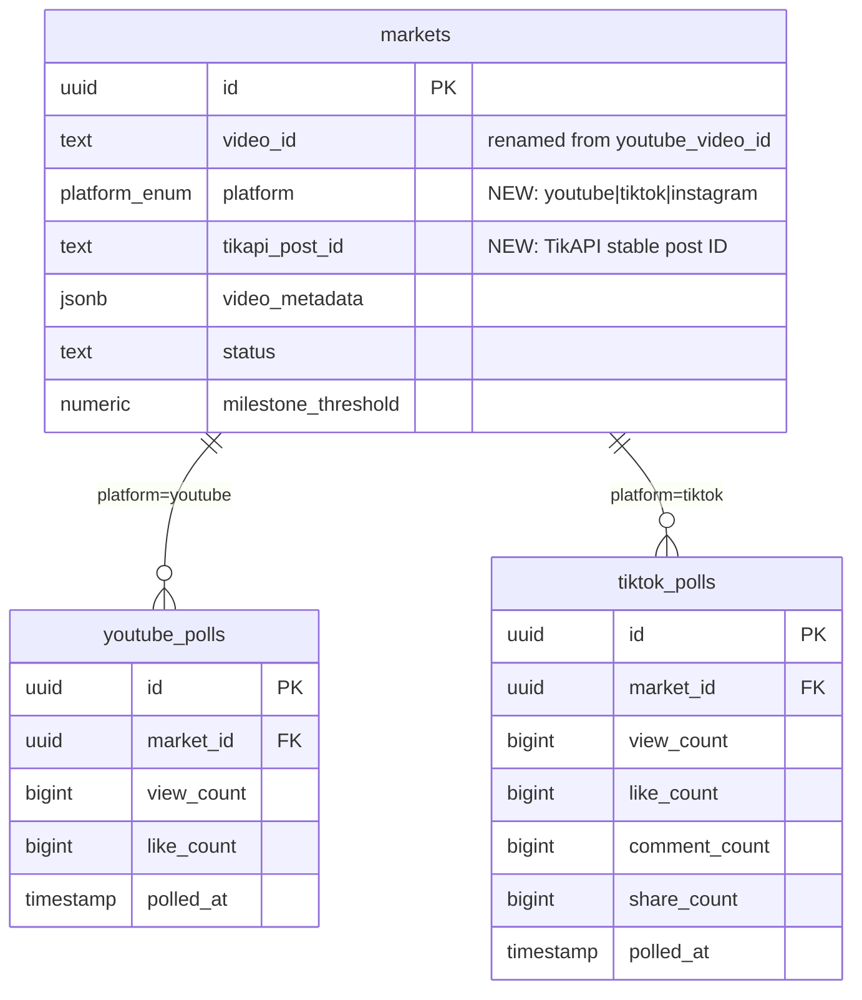

# Add TikTok Platform Support via TikAPI.io

## Overview

Replace the YouTube-only prediction market system with multi-platform support, starting with TikTok. This touches the database schema, a new TikAPI service, a new cron poller, admin market creation, the embed component, and—critically—the oracle resolution path.

## Problem Statement

Every layer of the app is hardwired to YouTube: `youtubeVideoId` in the schema, `youtubePolls` table, `YOUTUBE_THUMBNAIL_RE` allowlist, `youtube.ts` service, and `oracle.ts` resolution. TikTok markets will silently fail to resolve and produce phantom null-count polls unless each layer is updated in concert.

## Proposed Solution

Add a `platform` enum column to `markets`, rename `youtubeVideoId` → `videoId`, create a `tiktokPolls` table, add a `tiktok.ts` service, update the oracle and cron to dispatch by platform, update admin creation to detect TikTok URLs, and add a `TikTokEmbed` component.

---

## Implementation Phases

### Phase 1 — Database Migration

**File: `src/db/schema.ts`**

```ts
// Add platform enum
export const platformEnum = pgEnum("platform", ["youtube", "tiktok", "instagram"]);

// markets table changes:
// 1. Rename youtubeVideoId → videoId
// 2. Add platform column (default 'youtube')
// 3. Add tikapiPostId field for TikAPI's internal post ID
videoId: text("video_id").notNull(),
platform: platformEnum("platform").default("youtube").notNull(),
tikapiPostId: text("tikapi_post_id"),   // TikAPI-specific stable ID
```

**New `tiktokPolls` table** (mirrors `youtubePolls`, add composite index on day one):

```ts
export const tiktokPolls = pgTable("tiktok_polls", {
  id: uuid("id").defaultRandom().primaryKey(),
  marketId: uuid("market_id").notNull().references(() => markets.id, { onDelete: "cascade" }),
  viewCount: bigint("view_count", { mode: "number" }),
  likeCount: bigint("like_count", { mode: "number" }),
  commentCount: bigint("comment_count", { mode: "number" }),
  shareCount: bigint("share_count", { mode: "number" }),
  polledAt: timestamp("polled_at", { withTimezone: true }).defaultNow().notNull(),
}, (table) => ({
  marketIdx: index("tiktok_polls_market_id_idx").on(table.marketId),
  marketPolledIdx: index("tiktok_polls_market_polled_idx").on(table.marketId, table.polledAt),
}));
```

**Update `marketsRelations`** to include `tiktokPolls: many(tiktokPolls)`.

**Update `videoMetadata` JSONB type** to accommodate TikTok fields:
```ts
videoMetadata: jsonb("video_metadata").$type<{
  title: string;
  thumbnail: string;
  channelTitle: string;       // YouTube channelTitle / TikTok creatorName
  channelId?: string;         // YouTube only
  description?: string;
  creatorId?: string;         // TikTok creator unique ID
}>(),
```

**Migration notes:**
- `drizzle.config.ts` must have `dotenv.config({ path: ".env.local" })` at top — drizzle-kit does not auto-load `.env.local` (documented in `docs/solutions/`)
- Single migration: add `platform` with default 'youtube', rename `youtubeVideoId` → `videoId`, create `tiktok_polls` table
- Existing YouTube markets preserve data: `platform` defaults to 'youtube', `videoId` holds the existing YouTube video ID

**Update `src/types/market.ts`:**

```ts
// Replace youtubeVideoId with:
videoId: string;
platform: "youtube" | "tiktok" | "instagram";
tikapiPostId?: string;
```

---

### Phase 2 — TikAPI Service

**File: `src/lib/tiktok.ts`**

Install: `npm install tikapi` (check actual package name from https://github.com/tikapi-io/tiktok-api)

```ts
// src/lib/tiktok.ts
import TikAPI from "tikapi";

const api = TikAPI(process.env.TIKAPI_KEY!);

export interface TikTokStats {
  viewCount: number;
  likeCount: number;
  commentCount: number;
  shareCount: number;
  createdAt: string;
  creatorName: string;
  creatorId: string;
  thumbnailUrl: string;
  tikapiPostId: string;
}

/**
 * Extracts TikTok video ID from various URL formats:
 * - https://www.tiktok.com/@user/video/1234567890
 * - https://vm.tiktok.com/XXXXXXX/
 * - https://vt.tiktok.com/XXXXXXX/
 * - Bare numeric ID: "1234567890"
 */
export function extractTikTokVideoId(input: string): string | null {
  // Bare numeric ID
  if (/^\d{15,20}$/.test(input.trim())) return input.trim();

  // Full URL with video ID
  const longMatch = input.match(/tiktok\.com\/@[^/]+\/video\/(\d+)/);
  if (longMatch) return longMatch[1];

  // Short URLs (vm.tiktok.com, vt.tiktok.com) need redirect resolution — return null, caller should resolve first
  if (/vm\.tiktok\.com|vt\.tiktok\.com/.test(input)) return null;

  return null;
}

/**
 * Fetches video stats by video ID. Returns null if video is deleted/private.
 * Throws on API errors (rate limit, auth failure, network).
 */
export async function fetchTikTokStatsById(videoId: string): Promise<TikTokStats | null> {
  const response = await api.public.post({ id: videoId });

  const item = response?.data?.itemInfo?.itemStruct;
  if (!item) return null; // deleted or private

  return {
    viewCount: item.stats?.playCount ?? 0,
    likeCount: item.stats?.diggCount ?? 0,
    commentCount: item.stats?.commentCount ?? 0,
    shareCount: item.stats?.shareCount ?? 0,
    createdAt: new Date(item.createTime * 1000).toISOString(),
    creatorName: item.author?.nickname ?? "",
    creatorId: item.author?.uniqueId ?? "",
    thumbnailUrl: item.video?.cover ?? "",
    tikapiPostId: item.id ?? videoId,
  };
}

/**
 * Detects if a URL is a TikTok URL.
 */
export function isTikTokUrl(url: string): boolean {
  return /tiktok\.com/i.test(url);
}
```

**Environment:**

Add to `.env.local.example`:
```
TIKAPI_KEY=your_tikapi_key_here
```

**`src/lib/constants.ts` additions:**
```ts
// TikTok CDN domains for thumbnail allowlist (multiple CDN subdomains)
export const TIKTOK_THUMBNAIL_RE = /^https:\/\/[a-z0-9-]+\.tiktokcdn\.com\//;
export const TIKTOK_VIDEO_ID_RE = /^\d{15,20}$/;
```

---

### Phase 3 — Cron: `poll-tiktok`

**File: `src/app/api/cron/poll-tiktok/route.ts`** (mirrors `poll-youtube/route.ts` structure)

```ts
// Key differences from poll-youtube:
// 1. Filter markets WHERE platform = 'tiktok'
// 2. Call fetchTikTokStatsById() — one request per video (no batch endpoint)
// 3. Rate limit: 60 req/min on basic plan → use 1 req/sec delay for batches
// 4. Insert into tiktokPolls table
// 5. Store null for deleted/private (same sentinel pattern as youtube)

export async function GET(req: Request) {
  verifyCronAuth(req);

  const activeTiktokMarkets = await db
    .select()
    .from(markets)
    .where(
      and(
        eq(markets.platform, "tiktok"),
        or(eq(markets.status, "active"), eq(markets.status, "halted"))
      )
    );

  for (const market of activeTiktokMarkets) {
    try {
      const stats = await fetchTikTokStatsById(market.videoId);
      await db.insert(tiktokPolls).values({
        marketId: market.id,
        viewCount: stats?.viewCount ?? null,
        likeCount: stats?.likeCount ?? null,
        commentCount: stats?.commentCount ?? null,
        shareCount: stats?.shareCount ?? null,
      });
      // Rate limit: ~1 req/sec to stay under 60/min
      await new Promise(r => setTimeout(r, 1100));
    } catch (err) {
      console.error(`TikTok poll failed for market ${market.id}:`, err);
      // Continue to next market — don't fail the whole cron
    }
  }

  return Response.json({ ok: true, polled: activeTiktokMarkets.length });
}
```

**`poll-youtube` must add platform filter** (critical — without this, TikTok market `videoId` values get sent to YouTube API):

```ts
// src/app/api/cron/poll-youtube/route.ts — add WHERE clause
.where(
  and(
    eq(markets.platform, "youtube"),   // ← ADD THIS
    or(eq(markets.status, "active"), eq(markets.status, "halted"))
  )
)
```

---

### Phase 4 — Oracle Update (Critical)

**File: `src/lib/oracle.ts`**

`resolveMarket` currently hardcodes `youtubePolls`. TikTok markets will always fail to resolve without this fix:

```ts
export async function resolveMarket(marketId: string) {
  const [market] = await db.select().from(markets).where(eq(markets.id, marketId));
  if (!market) throw new Error(`Market ${marketId} not found`);

  // Platform-aware poll lookup
  let latestPoll: { viewCount: number | null; likeCount: number | null } | undefined;

  if (market.platform === "tiktok") {
    const [poll] = await db
      .select()
      .from(tiktokPolls)
      .where(eq(tiktokPolls.marketId, marketId))
      .orderBy(desc(tiktokPolls.polledAt))
      .limit(1);
    latestPoll = poll;
  } else {
    const [poll] = await db
      .select()
      .from(youtubePolls)
      .where(eq(youtubePolls.marketId, marketId))
      .orderBy(desc(youtubePolls.polledAt))
      .limit(1);
    latestPoll = poll;
  }

  if (!latestPoll) throw new Error(`No poll data for market ${marketId}`);
  // ... rest of resolution logic unchanged
}
```

---

### Phase 5 — Admin Market Creation

**File: `src/lib/actions/admin.ts`**

```ts
// fetchVideoStats: detect platform from URL
export async function fetchVideoStats(formData: FormData) {
  const videoUrl = formData.get("videoUrl") as string;

  if (isTikTokUrl(videoUrl)) {
    const videoId = extractTikTokVideoId(videoUrl);
    if (!videoId) return { error: "Invalid TikTok URL" };

    const stats = await fetchTikTokStatsById(videoId);
    if (!stats) return { error: "TikTok video not found or private" };

    return {
      platform: "tiktok" as const,
      videoId,
      tikapiPostId: stats.tikapiPostId,
      viewCount: stats.viewCount,
      likeCount: stats.likeCount,
      title: "",  // fetched from TikAPI item
      thumbnail: stats.thumbnailUrl,
      channelTitle: stats.creatorName,
      creatorId: stats.creatorId,
    };
  }

  // existing YouTube path unchanged ...
}

// createMarket: thumbnail validation update
// Replace YOUTUBE_THUMBNAIL_RE guard with platform-aware check:
const isValidThumbnail =
  market.platform === "tiktok"
    ? TIKTOK_THUMBNAIL_RE.test(thumbnailRaw)
    : YOUTUBE_THUMBNAIL_RE.test(thumbnailRaw);

if (!isValidThumbnail) {
  // reject or use empty string
}
```

**Admin form (`src/app/admin/markets/new/page.tsx`):**
- Update URL field label from "YouTube Video URL" to "Video URL (YouTube or TikTok)"
- Update placeholder to show both URL formats

---

### Phase 6 — TikTok Embed Component

**File: `src/components/TikTokEmbed.tsx`**

```tsx
interface TikTokEmbedProps {
  videoId: string;
  title?: string;
}

export function TikTokEmbed({ videoId, title }: TikTokEmbedProps) {
  return (
    <div className="relative" style={{ paddingBottom: "177.78%", height: 0 }}>
      <iframe
        src={`https://www.tiktok.com/embed/v2/${videoId}`}
        title={title ?? "TikTok video"}
        className="absolute inset-0 w-full h-full"
        allow="autoplay; encrypted-media"
        allowFullScreen
      />
    </div>
  );
}
```

**Update `src/app/markets/[id]/page.tsx`** to conditionally render embed:

```tsx
{market.platform === "tiktok" ? (
  <TikTokEmbed videoId={market.videoId} title={videoMetadata?.title} />
) : (
  <iframe
    src={`https://www.youtube.com/embed/${market.videoId}`}
    // ... existing YouTube iframe props
  />
)}
```

Also update poll history query to read from `tiktokPolls` when `market.platform === "tiktok"`.

**`next.config.ts` additions:**
```ts
// images.remotePatterns — add TikTok CDN
{ protocol: "https", hostname: "*.tiktokcdn.com" },
{ protocol: "https", hostname: "p16-sign.tiktokcdn.com" },

// CSP headers
// img-src: add https://*.tiktokcdn.com
// frame-src: add https://www.tiktok.com
```

---

## System-Wide Impact

### Files Changed Summary

| File | Change |
|------|--------|
| `src/db/schema.ts` | Add `platform` enum + column, rename `youtubeVideoId` → `videoId`, add `tikapiPostId`, new `tiktokPolls` table, update relations |
| `src/types/market.ts` | Replace `youtubeVideoId` with `videoId` + `platform` + `tikapiPostId?` |
| `src/lib/constants.ts` | Add `TIKTOK_THUMBNAIL_RE`, `TIKTOK_VIDEO_ID_RE` |
| `src/lib/tiktok.ts` | **New file** — `extractTikTokVideoId`, `fetchTikTokStatsById`, `isTikTokUrl` |
| `src/lib/oracle.ts` | Platform-aware poll table dispatch in `resolveMarket` |
| `src/app/api/cron/poll-youtube/route.ts` | Add `WHERE platform = 'youtube'` filter |
| `src/app/api/cron/poll-tiktok/route.ts` | **New file** — polls TikTok markets with rate limiting |
| `src/lib/actions/admin.ts` | Platform detection in `fetchVideoStats`, thumbnail guard update |
| `src/app/admin/markets/new/page.tsx` | Update URL field label/placeholder |
| `src/components/TikTokEmbed.tsx` | **New file** — 9:16 iframe component |
| `src/app/markets/[id]/page.tsx` | Conditional embed + conditional poll history query |
| `next.config.ts` | TikTok CDN in `remotePatterns` + CSP |
| `.env.local.example` | Add `TIKAPI_KEY` |

### Interaction Graph

`poll-tiktok cron` → `fetchTikTokStatsById` → TikAPI.io → insert `tiktokPolls` row → `resolveMarket` (via `resolve-markets` cron) reads `tiktokPolls` → resolves market → LMSR payout logic (unchanged)

### Error & Failure Propagation

| Error | Behavior |
|-------|----------|
| TikAPI 429 rate limit | Log and skip; next cron tick retries |
| Video deleted/private | Store `null` poll row; oracle treats null as "stats unavailable", market stays active until resolution window |
| TikAPI downtime | Catch in cron loop, continue to next market, surface in cron response log |
| Invalid TikTok URL in admin | Return `{ error: "Invalid TikTok URL" }` same pattern as YouTube |

### Backward Compatibility

- All existing YouTube markets: `platform` defaults to `'youtube'`, `videoId` holds the existing YouTube video ID — zero data loss
- `poll-youtube` gains a platform filter — YouTube markets continue polling normally
- `oracle.ts` dispatches on `market.platform` — existing YouTube market resolution unchanged

---

## Acceptance Criteria

- [ ] Admin can paste `https://www.tiktok.com/@user/video/1234567890` and create a market
- [ ] Phase 1 (fetch stats) returns TikTok view/like/comment/share counts from TikAPI
- [ ] `createMarket` stores `platform='tiktok'`, `videoId`, `tikapiPostId`, thumbnail from TikAPI
- [ ] `poll-tiktok` cron inserts rows into `tiktokPolls` every 15 minutes
- [ ] `poll-youtube` cron only polls YouTube markets (platform filter added)
- [ ] `resolveMarket` reads `tiktokPolls` for TikTok markets — does NOT auto-fail
- [ ] TikTok embed renders at 9:16 aspect ratio on market detail page
- [ ] Poll history chart renders for TikTok markets (reads `tiktokPolls`)
- [ ] Existing YouTube markets unaffected — all data preserved, resolution unchanged
- [ ] Invalid/private TikTok video returns clear error in admin form
- [ ] TikTok thumbnail CDN URLs pass the `TIKTOK_THUMBNAIL_RE` allowlist check

---

## ERD — Schema Changes



---

## Dependencies & Risks

| Risk | Mitigation |
|------|-----------|
| TikTok CDN thumbnail URLs expire (signed tokens) | Store thumbnail at market creation; refresh on each poll via `videoMetadata` update in cron |
| TikAPI package name differs from `@tikapi/core` | Verify from https://github.com/tikapi-io/tiktok-api before install |
| `drizzle-kit` won't read `.env.local` | Confirm `dotenv.config` in `drizzle.config.ts` before running migration |
| No TikAPI batch endpoint (1 req/video) | 1100ms delay between requests in cron; max ~54 markets per 15-min window |
| `ChannelHistorySection` uses YouTube-only channel ID | Conditionally hide for TikTok markets (no equivalent creator history API) |

## Sources & References

- Repo: `src/db/schema.ts` — existing `youtubePolls` table pattern
- Repo: `src/app/api/cron/poll-youtube/route.ts` — cron auth + poll loop pattern
- Repo: `src/lib/oracle.ts` — `resolveMarket` requiring platform dispatch
- Repo: `src/lib/actions/admin.ts` — `fetchVideoStats` + `createMarket` pattern
- Institutional: `docs/solutions/database-issues/` — composite index on `(marketId, polledAt)` required from day one
- Institutional: `docs/solutions/integration-issues/drizzle-kit-env-local-configuration.md` — dotenv in drizzle.config.ts
