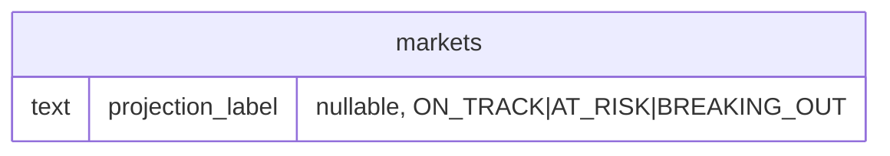

# feat: AI Projection Badge — Feed + Market Detail

## Overview

Add a corner pill badge to every `FeedCard` and an expanded badge + one-sentence explanation above the bet panel on `/markets/[id]`. Three states: **ON TRACK** (green), **AT RISK** (amber), **BREAKING OUT** (purple). Label is computed server-side from rolling view/like velocity vs required velocity to hit `milestoneThreshold` by `resolvesAt`, stored in the `markets` table, and refreshed on every 10-minute cron poll tick.

---

## Problem Statement

Users have no signal about whether a market's underlying video is trending toward its milestone or falling behind. getspike.app shows this projection prominently; adding it closes the most significant UX gap for engaged bettors.

---

## Proposed Solution

1. Add a nullable `projection_label` text column to the `markets` table.
2. Implement `src/lib/projection.ts` — a pure, testable function that encapsulates the velocity rule.
3. Call it inside `pollAllActiveMarkets` after each successful poll insert, write the label back to `markets`.
4. Thread the stored label from the DB → page SSR → `DiscoverFeed` → `FeedCard` (pill badge) and `GET /api/markets/[id]` → `MarketHUD` (badge + explanation).

No new pages. No new API routes. Projection label updates every ~10 minutes with the cron; no real-time streaming needed.

---

## Technical Approach

### Architecture

```
[Vercel cron: */10 * * * *]
    └─> pollAllActiveMarkets()
            ├─> db.insert(tiktokPolls)              ← existing
            ├─> computeProjectionLabel(...)         ← NEW
            └─> db.update(markets).set({ projectionLabel }) ← NEW

[page.tsx — SSR]
    └─> SELECT * FROM markets                       ← already fetches all columns
            └─> DiscoverFeed (feedMarkets)
                    └─> FeedCard (projectionLabel)  ← pill badge

[GET /api/markets/[id]]
    └─> SELECT markets.*                            ← already fetches all columns
            └─> payload.projectionLabel             ← add to response
                    └─> MarketHUD                   ← badge + explanation
```

### Projection Rule (from wiki spec)

```
requiredVelocity  = viewsRemaining / hoursRemaining
rollingVelocity   = (currentMetric - metric24hAgo) / 24

rollingVelocity >= 1.1 × requiredVelocity  →  BREAKING_OUT
rollingVelocity >= 0.8 × requiredVelocity  →  ON_TRACK
else                                        →  AT_RISK
```

`questionType === "views"` uses `viewCount`; `questionType === "likes"` uses `likeCount`.

### Edge Cases

| Condition | Behaviour |
|-----------|-----------|
| `resolvesAt` is null | Skip computation; `projectionLabel` stays null; no badge rendered |
| < 24h of poll history (no row ≥ 24h old) | Return `ON_TRACK` — low-confidence fallback per spec |
| `hoursRemaining <= 0` (past deadline) | Return `AT_RISK` — market overdue |
| `viewsRemaining <= 0` (milestone already exceeded) | Return `BREAKING_OUT` — milestone already hit |
| `rollingVelocity <= 0` (data anomaly — count went down) | Return `AT_RISK` |
| Market status `halted` / `resolving` | Badge still displayed (label was computed while active) |

---

## Implementation Phases

### Phase 1 — Schema Migration

**Files:** `src/db/schema.ts`, new migration in `drizzle/`

1. **Verify `drizzle.config.ts`** calls `config({ path: ".env.local" })` before `defineConfig` — if absent the CLI silently fails to connect (see `docs/solutions/integration-issues/drizzle-kit-env-local-configuration.md`).

2. Add to the `markets` table definition in `src/db/schema.ts`, after `resolvedAt`:

    ```ts
    projectionLabel: text("projection_label"),
    ```

    - Plain nullable `text` — no `pgEnum`, matching project convention (the `platform` enum was dropped in migration 0003; all status columns use `text + .$type<>()`).
    - No default; `null` means "not yet computed."

3. Add TypeScript type alias (same file, near `MarketStatus`):

    ```ts
    export type ProjectionLabel = "ON_TRACK" | "AT_RISK" | "BREAKING_OUT";
    ```

4. Generate and apply the migration:

    ```bash
    npm run db:generate
    npm run db:migrate
    ```

    Expected generated SQL:
    ```sql
    ALTER TABLE "markets" ADD COLUMN "projection_label" text;
    ```

**ERD delta:**



---

### Phase 2 — Projection Logic Module

**File:** `src/lib/projection.ts` (new file)

Pure function — no DB access, no side effects. Easy to unit-test.

```ts
// src/lib/projection.ts
import type { ProjectionLabel } from "@/db/schema";

export function computeProjectionLabel({
  currentMetric,
  metric24hAgo,
  milestoneThreshold,
  resolvesAt,
}: {
  currentMetric: number;
  metric24hAgo: number | null;
  milestoneThreshold: number;
  resolvesAt: Date;
}): ProjectionLabel {
  const hoursRemaining = (resolvesAt.getTime() - Date.now()) / (1000 * 60 * 60);

  if (hoursRemaining <= 0) return "AT_RISK";

  const viewsRemaining = milestoneThreshold - currentMetric;
  if (viewsRemaining <= 0) return "BREAKING_OUT";

  const requiredVelocity = viewsRemaining / hoursRemaining;

  // < 24h of poll history — low-confidence fallback per spec
  if (metric24hAgo === null) return "ON_TRACK";

  const rollingVelocity = (currentMetric - metric24hAgo) / 24;

  if (rollingVelocity <= 0) return "AT_RISK";
  if (rollingVelocity >= 1.1 * requiredVelocity) return "BREAKING_OUT";
  if (rollingVelocity >= 0.8 * requiredVelocity) return "ON_TRACK";
  return "AT_RISK";
}
```

**One-sentence explanation strings** (used on market detail page — no extra column needed):

```ts
export const PROJECTION_EXPLANATIONS: Record<ProjectionLabel, string> = {
  ON_TRACK: "This video is on pace to hit its milestone by the deadline.",
  AT_RISK: "Velocity is below the pace needed to hit this milestone.",
  BREAKING_OUT: "Growing faster than required — this market is trending.",
};
```

---

### Phase 3 — Cron Integration

**File:** `src/lib/poll-active-markets.ts`

**Where to hook in:** Inside the `if (stats !== null)` block, immediately after the `db.insert(tiktokPolls)` call (currently line 131). Add a projection update block analogous to the existing CDN URL dirty-check block (lines 151–177).

**Changes:**

1. Add import at top:

    ```ts
    import { computeProjectionLabel } from "@/lib/projection";
    import { lte, desc } from "drizzle-orm";
    ```

2. After the poll insert, within the `if (stats !== null)` block — add:

    ```ts
    // Compute and persist projection label
    if (market.resolvesAt) {
      try {
        const currentMetric =
          market.questionType === "views" ? stats.viewCount : stats.likeCount;
        const threshold = Number(market.milestoneThreshold);

        // Fetch the latest poll from ≥24h ago for rolling velocity
        const twentyFourHoursAgo = new Date(Date.now() - 24 * 60 * 60 * 1000);
        const [oldPoll] = await db
          .select({
            viewCount: tiktokPolls.viewCount,
            likeCount: tiktokPolls.likeCount,
          })
          .from(tiktokPolls)
          .where(
            and(
              eq(tiktokPolls.marketId, market.id),
              lte(tiktokPolls.polledAt, twentyFourHoursAgo)
            )
          )
          .orderBy(desc(tiktokPolls.polledAt))
          .limit(1);

        const oldMetric = oldPoll
          ? Number(market.questionType === "views" ? oldPoll.viewCount : oldPoll.likeCount)
          : null;

        const label = computeProjectionLabel({
          currentMetric,
          metric24hAgo: oldMetric,
          milestoneThreshold: threshold,
          resolvesAt: market.resolvesAt,
        });

        await db
          .update(markets)
          .set({ projectionLabel: label })
          .where(eq(markets.id, market.id));
      } catch (err) {
        console.error(`[poll] projection label failed for ${market.id}:`, err);
        // Non-fatal: prior label (or null) stays in DB; poll row already committed
      }
    }
    ```

**Why a separate query per market:** The 24h-old poll row can't be bundled into the batch DISTINCT ON query at the top of the function (that only fetches the latest poll time for cooldown logic). Adding one indexed SELECT per market (using `tiktok_polls_market_polled_idx` on `(market_id, polled_at)`) is the right tradeoff — minimal overhead, correct semantics.

**Timestamp caveat:** Use `lte(tiktokPolls.polledAt, twentyFourHoursAgo)` with Drizzle's typed column — this generates `WHERE polled_at <= $1` using the parameterized Drizzle query builder, avoiding the Neon bare-string timezone parsing bug (see `docs/solutions/logic-errors/neon-timestamp-utc-offset-cron-cooldown-null-poll-guard.md`). Do NOT use raw SQL `EXTRACT(EPOCH)` here since Drizzle's typed comparison is safe.

---

### Phase 4 — Feed SSR + SWR Plumbing

**No changes to `/api/feed/polls`** — projection label is stable (updates every 10 min), so it does not need to flow through the 60s SWR live-refresh path. It comes down with the initial SSR render and stays static between page navigations.

**`src/components/DiscoverFeed.tsx`**

Add to the local `FeedMarket` interface (line 18):

```ts
projectionLabel?: ProjectionLabel | null;
```

Add to `FeedCard` instantiation in the feed's `map()`:

```tsx
projectionLabel={market.projectionLabel as ProjectionLabel | null}
```

**`src/app/page.tsx`** — no changes needed. `SELECT *` from markets already returns all columns; the Drizzle row type picks up `projectionLabel` automatically once the schema is updated.

**`src/components/FeedCard.tsx`**

1. Add to `FeedCardProps`:

    ```ts
    projectionLabel?: ProjectionLabel | null;
    ```

2. Add a `PROJECTION_BADGE` constant at **module level** (top of file, outside the component — recreating it on every render is wasteful):

    ```ts
    import type { ProjectionLabel } from "@/db/schema";

    const PROJECTION_BADGE: Record<ProjectionLabel, { label: string; className: string }> = {
      ON_TRACK:     { label: "On Track",     className: "bg-green-500/20 text-green-400 border border-green-500/40" },
      AT_RISK:      { label: "At Risk",      className: "bg-amber-500/20 text-amber-400 border border-amber-500/40" },
      BREAKING_OUT: { label: "Breaking Out", className: "bg-purple-500/20 text-purple-400 border border-purple-500/40" },
    };
    ```

3. **Mobile — top-left badge `div`** (currently lines 546–556): Convert from a single badge to a stacked pair. The status badge (halted/resolving/trending) takes priority. The projection badge is always rendered below it when available:

    ```tsx
    <div className="absolute top-4 left-4 z-10 flex flex-col gap-1.5 items-start">
      {(status === "halted" || status === "resolving") ? (
        <span className="px-2.5 py-1 rounded-full text-xs font-semibold bg-amber-500/20 text-amber-400 border border-amber-500/40 uppercase tracking-wide">
          {status === "resolving" ? "Resolving" : "Halted"}
        </span>
      ) : isTrending ? (
        <span className="px-2.5 py-1 rounded-full text-xs font-semibold bg-accent/20 text-accent border border-accent/40 uppercase tracking-wide">
          Trending
        </span>
      ) : null}
      {projectionLabel && (
        <span className={`px-2.5 py-1 rounded-full text-xs font-semibold uppercase tracking-wide ${PROJECTION_BADGE[projectionLabel].className}`}>
          {PROJECTION_BADGE[projectionLabel].label}
        </span>
      )}
    </div>
    ```

4. **Desktop HUD status row** (lines 430–438): After the existing status/trending badge `span`, add the projection badge as a sibling:

    ```tsx
    {projectionLabel && (
      <span className={`self-start px-2.5 py-1 rounded-full text-xs font-semibold uppercase tracking-wide ${PROJECTION_BADGE[projectionLabel].className}`}>
        {PROJECTION_BADGE[projectionLabel].label}
      </span>
    )}
    ```

---

### Phase 5 — Market Detail API + UI

**`src/types/market.ts`**

Add to `MarketData`:

```ts
projectionLabel?: ProjectionLabel | null;
```

Import `ProjectionLabel` from `@/db/schema` at the top of the file.

**`src/app/api/markets/[id]/route.ts`**

Add to the `payload` object (after `userPosition`):

```ts
projectionLabel: market.projectionLabel ?? null,
```

No caching concern — this route already has `export const dynamic = "force-dynamic"` and returns `Cache-Control: no-store`.

**`src/components/MarketHUD.tsx`**

1. Import the shared constants from `projection.ts` (do not redefine locally — duplication causes drift):

    ```ts
    import { PROJECTION_EXPLANATIONS } from "@/lib/projection";
    import type { ProjectionLabel } from "@/db/schema";
    ```

    Define styles and display labels in `MarketHUD` (these are UI-specific, not shared):

    ```ts
    const PROJECTION_STYLES: Record<ProjectionLabel, string> = {
      ON_TRACK:     "bg-green-500/20 text-green-400 border border-green-500/40",
      AT_RISK:      "bg-amber-500/20 text-amber-400 border border-amber-500/40",
      BREAKING_OUT: "bg-purple-500/20 text-purple-400 border border-purple-500/40",
    };
    const PROJECTION_DISPLAY: Record<ProjectionLabel, string> = {
      ON_TRACK: "On Track", AT_RISK: "At Risk", BREAKING_OUT: "Breaking Out",
    };
    ```

2. Add badge block above the outer action slot `div` (currently at line 128):

    ```tsx
    {market.projectionLabel && (
      <div className="flex items-center gap-2 mb-3">
        <span className={`px-2.5 py-1 rounded-full text-xs font-semibold uppercase tracking-wide ${PROJECTION_STYLES[market.projectionLabel as ProjectionLabel]}`}>
          {PROJECTION_DISPLAY[market.projectionLabel as ProjectionLabel]}
        </span>
        <span className="text-xs text-muted">
          {PROJECTION_EXPLANATIONS[market.projectionLabel as ProjectionLabel]}
        </span>
      </div>
    )}
    ```

---

## System-Wide Impact

### Interaction Graph

```
Cron tick (/api/cron/poll-tiktok)
  → pollAllActiveMarkets()
    → fetchTikTokStatsById()            (TikWM API call)
    → db.insert(tiktokPolls)
    → db.select(tiktokPolls) [24h query] ← NEW
    → computeProjectionLabel()           ← NEW (pure, no I/O)
    → db.update(markets).set({ projectionLabel }) ← NEW
    → [existing CDN URL refresh block]
    → [existing auto-resolve block]
```

Page load:
```
page.tsx SSR → SELECT * FROM markets → feedMarkets[].projectionLabel
  → DiscoverFeed → FeedCard.projectionLabel prop → pill badge rendered
```

Market detail:
```
GET /api/markets/[id] → payload.projectionLabel
  → useMarketData (SWR, 60s refresh) → MarketHUD → badge + explanation
```

### Error & Failure Propagation

- If the 24h-poll query throws (DB error): wrap the entire projection block in `try/catch`; log the error and continue without updating `projectionLabel`. The stored label from the previous tick remains — stale by at most 10 minutes, acceptable.
- If `computeProjectionLabel` throws (e.g. invalid inputs): same catch block. Label stays at previous value.
- If the `db.update` for `projectionLabel` throws: catch and log; the poll insert has already succeeded, so the poll row is committed. This does not affect market resolution.

### State Lifecycle Risks

- The projection label is a non-critical derived column. A stale value (from the prior cron tick) is the worst-case failure mode — no orphaned state, no rollback needed.
- Resolved/cancelled markets retain their last-computed `projectionLabel`. Since the badge is only rendered on `active`/`halted`/`resolving` cards, this value is never displayed post-resolution.

### API Surface Parity

- `GET /api/markets/[id]` — add `projectionLabel` to payload ✓
- `GET /api/feed/polls` — **no change** (projection is stable enough to skip the 60s refresh path)
- `GET /api/admin/*` routes — no change needed (admin doesn't display projection badges)

### Integration Test Scenarios

1. **Market with 48h of poll history, trending video:** Cron fires, 24h-old poll found, rollingVelocity >> requiredVelocity → `BREAKING_OUT` stored; FeedCard shows purple pill.
2. **Market created 6 hours ago (no 24h history):** Cron fires, no old poll found, fallback → `ON_TRACK`; FeedCard shows green pill.
3. **Market 2 hours from deadline, views well below milestone:** Cron fires → `AT_RISK`; FeedCard shows amber pill; market detail shows amber pill + explanation.
4. **Market with `resolvesAt: null` (draft/misconfigured):** Cron skips projection block entirely; `projectionLabel` stays null; no badge rendered.
5. **DB update for `projectionLabel` fails:** Error is caught and logged; poll insert committed; label from previous tick preserved; UI shows prior state.

---

## Acceptance Criteria

### Functional

- [ ] `markets.projection_label` column exists in production after migration
- [ ] `computeProjectionLabel` returns correct label for all edge cases (see table above)
- [ ] Cron writes `projectionLabel` to DB after each successful poll with `resolvesAt` set
- [ ] Markets with `resolvesAt: null` are skipped — `projectionLabel` stays null
- [ ] Markets with < 24h poll history fall back to `ON_TRACK`
- [ ] FeedCard renders the projection pill on both mobile (top-left absolute) and desktop (HUD row)
- [ ] Pill is NOT rendered when `projectionLabel` is null
- [ ] Market detail page shows badge + one-sentence explanation above the bet panel
- [ ] Badge and explanation are NOT rendered when `projectionLabel` is null

### Visual

- [ ] ON TRACK → green pill (`bg-green-500/20 text-green-400 border border-green-500/40`)
- [ ] AT RISK → amber pill (`bg-amber-500/20 text-amber-400 border border-amber-500/40`)
- [ ] BREAKING OUT → purple pill (`bg-purple-500/20 text-purple-400 border border-purple-500/40`)
- [ ] Pill uses `rounded-full uppercase tracking-wide` consistent with existing status/trending pills
- [ ] Status badge (halted/resolving/trending) and projection pill coexist when both apply

### Non-Functional

- [ ] Projection computation adds ≤ 1 DB query per market per cron tick (the 24h poll SELECT)
- [ ] Projection failure is caught and logged without crashing the poll loop
- [ ] No change to the 3-layer caching behavior of existing live-data routes

---

## Dependencies & Prerequisites

| Item | Status |
|------|--------|
| `tiktok_polls_market_polled_idx` on `(market_id, polled_at)` | Already exists — powers the 24h query |
| Drizzle-kit `.env.local` fix in `drizzle.config.ts` | Verify before running migration |
| Tailwind v4 CSS token `text-green-400`, `text-purple-400` | Verify against `src/app/globals.css` — use project token names if different |

---

## Risk Analysis & Mitigation

| Risk | Likelihood | Mitigation |
|------|-----------|------------|
| 24h query adds latency to cron tick | Low | Single indexed SELECT per market; cron budget guard absorbs extra time |
| Purple (`text-purple-400`) not a CSS token in this project | Medium | Check `globals.css` before Phase 4; substitute with `text-violet-400` or `text-fuchsia-400` if needed |
| `milestoneThreshold` bigint overflow in Number() | Very low | Milestones are TikTok view counts; safely within Number range |
| `projectionLabel` appears on resolved market cards | None | Badge only rendered in feed which shows active/halted/resolving markets |

---

## Testing Checklist

- [ ] Run `npm run db:generate` — confirm SQL only adds `projection_label` column, no other drift
- [ ] Run `npm run db:migrate` — apply to dev DB
- [ ] Run `npm run dev`, manually trigger cron: `curl localhost:3000/api/cron/poll-tiktok?force=true` (with auth header) — verify `projectionLabel` written to DB
- [ ] Inspect `markets` rows in DB — confirm `projection_label` values are `ON_TRACK | AT_RISK | BREAKING_OUT | null`
- [ ] Load feed page — verify pills appear on cards with labels
- [ ] Load `/markets/[id]` for a market with a label — verify badge + explanation above bet panel
- [ ] Load `/markets/[id]` for a market with `projectionLabel: null` — verify no badge rendered
- [ ] Simulate < 24h market (delete old polls): verify `ON_TRACK` fallback
- [ ] TypeScript: `npm run build` — zero type errors
- [ ] Lint: `npm run lint` — zero lint errors

---

## Sources & References

### Internal References

- Schema definition: `src/db/schema.ts:89–125` (markets table)
- Poll loop hook-in point: `src/lib/poll-active-markets.ts:131` (after tiktokPolls insert)
- CDN dirty-check pattern to follow: `src/lib/poll-active-markets.ts:151–177`
- FeedCard mobile badge div: `src/components/FeedCard.tsx:546–556`
- FeedCard desktop HUD badge: `src/components/FeedCard.tsx:430–438`
- MarketHUD action slot: `src/components/MarketHUD.tsx:128`
- MarketData type: `src/types/market.ts`
- DiscoverFeed FeedMarket interface: `src/components/DiscoverFeed.tsx:18`
- Drizzle .env.local gotcha: `docs/solutions/integration-issues/drizzle-kit-env-local-configuration.md`
- Neon timestamp timezone bug: `docs/solutions/logic-errors/neon-timestamp-utc-offset-cron-cooldown-null-poll-guard.md`
- Three-layer cache pattern: `docs/solutions/runtime-errors/nextjs-swr-three-layer-cache-stale.md`
- Feature tracker: `docs/ideation/2026-04-15-getspike-clone-ideation.md` (Feature 3)
- Wiki feature page: `projects/wiki/projects/virality/pages/features/getspike-parity-features.md#3`
